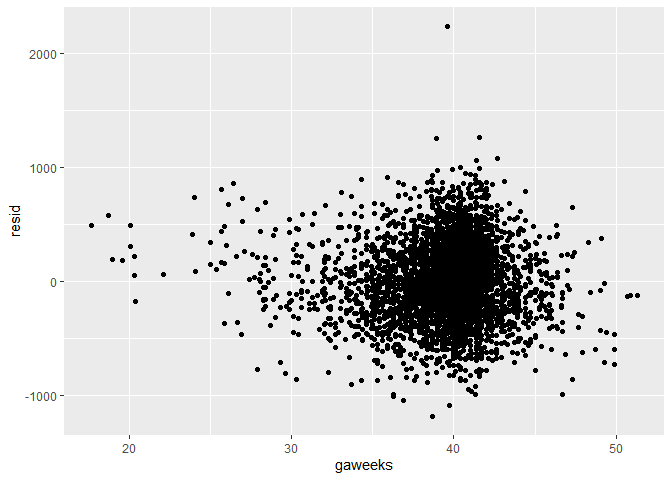

p8105_hw6_ncl2127
================
2023-11-27

``` r
library(tidyverse)
```

    ## ── Attaching core tidyverse packages ──────────────────────── tidyverse 2.0.0 ──
    ## ✔ dplyr     1.1.2     ✔ readr     2.1.4
    ## ✔ forcats   1.0.0     ✔ stringr   1.5.0
    ## ✔ ggplot2   3.4.3     ✔ tibble    3.2.1
    ## ✔ lubridate 1.9.2     ✔ tidyr     1.3.0
    ## ✔ purrr     1.0.2     
    ## ── Conflicts ────────────────────────────────────────── tidyverse_conflicts() ──
    ## ✖ dplyr::filter() masks stats::filter()
    ## ✖ dplyr::lag()    masks stats::lag()
    ## ℹ Use the conflicted package (<http://conflicted.r-lib.org/>) to force all conflicts to become errors

``` r
library(tidyr)
library(dplyr)
library(stringr)
library(ggplot2)
library(broom)
```

    ## Warning: package 'broom' was built under R version 4.3.2

``` r
library(purrr)
library(modelr)
```

    ## 
    ## Attaching package: 'modelr'
    ## 
    ## The following object is masked from 'package:broom':
    ## 
    ##     bootstrap

``` r
library(mgcv)
```

    ## Loading required package: nlme
    ## 
    ## Attaching package: 'nlme'
    ## 
    ## The following object is masked from 'package:dplyr':
    ## 
    ##     collapse
    ## 
    ## This is mgcv 1.9-0. For overview type 'help("mgcv-package")'.

Problem 2

``` r
weather_df = 
  rnoaa::meteo_pull_monitors(
    c("USW00094728"),
    var = c("PRCP", "TMIN", "TMAX"), 
    date_min = "2022-01-01",
    date_max = "2022-12-31") |>
  mutate(
    name = recode(id, USW00094728 = "CentralPark_NY"),
    tmin = tmin / 10,
    tmax = tmax / 10) |>
  select(name, id, everything())
```

    ## using cached file: C:\Users\ahsin\AppData\Local/R/cache/R/rnoaa/noaa_ghcnd/USW00094728.dly

    ## date created (size, mb): 2023-09-28 10:33:50.935362 (8.541)

    ## file min/max dates: 1869-01-01 / 2023-09-30

``` r
boot_straps = 
  weather_df |>
  modelr::bootstrap(n = 5000)|>
  pull(strap) |>
  nth(1) |>
  as_tibble()
  
boot_strap_res = weather_df |>
  modelr::bootstrap(n = 5000) |>
  mutate(
    models = map(strap, \(df) lm(tmax ~ tmin + prcp, data = df) ),
    results = map(models, broom::tidy),
    glance = map(models, broom::glance)) |> 
  select(-strap, -models) |>
  unnest(results)|>
  janitor::clean_names()
```

``` r
tmin_boot = boot_strap_res |> filter(term == "tmin")
prcp_boot = boot_strap_res |> filter(term == "prcp")

boot_strap_log = log(tmin_boot$estimate*prcp_boot$estimate)|> as_tibble()|> rowid_to_column(var = "id") |> drop_na() |> rename(logB1_B2 = value)
```

    ## Warning in log(tmin_boot$estimate * prcp_boot$estimate): NaNs produced

``` r
r_squared_boot = boot_strap_res |> select(id, glance) |> unnest(glance)|>janitor::clean_names()|> distinct(id, .keep_all = TRUE)

log_plot = ggplot(boot_strap_log, aes(x = logB1_B2)) +
  geom_density()

r_sq_plot = ggplot(r_squared_boot, aes(x = r_squared)) + 
  geom_density()

log_plot
```

<!-- -->

``` r
r_sq_plot
```

<!-- -->

``` r
conf_int_log <- boot_strap_log |>
  summarize(
    ci_lower = quantile(logB1_B2, 0.025), 
    ci_upper = quantile(logB1_B2, 0.975))

conf_int_rsq <- r_squared_boot |>
  summarize(
    ci_lower = quantile(r_squared, 0.025), 
    ci_upper = quantile(r_squared, 0.975))
```

The $log(\beta_{1}*\beta_{2})$ plot shows a moderately left-skewed
distribution. The r-squared plot shows a relatively left-skewed
distribution as well, however it seems to be less skewed than the log
plot. Both distributions follow a normal distribution somewhat closely,
but not exactly due to their skewness. We are 95% confident that the
true $log(\beta_{1}*\beta_{2})$ value lies between the interval of
(-9.0074828, -4.5289931). We are 95% confident that the true r-squared
value lies between the interval of (0.8894812, 0.9406415).

Problem 3

## Dataset cleaning

``` r
bw_df = read_csv("data/birthweight.csv") |>
  drop_na()
```

    ## Rows: 4342 Columns: 20
    ## ── Column specification ────────────────────────────────────────────────────────
    ## Delimiter: ","
    ## dbl (20): babysex, bhead, blength, bwt, delwt, fincome, frace, gaweeks, malf...
    ## 
    ## ℹ Use `spec()` to retrieve the full column specification for this data.
    ## ℹ Specify the column types or set `show_col_types = FALSE` to quiet this message.

``` r
bw_df$babysex <- factor(bw_df$babysex, levels = c("1", "2"))
bw_df$frace <- factor(bw_df$frace, levels = c("1", "2", "3", "4", "8", "9"))
bw_df$malform <- factor(bw_df$malform, levels = c("0", "1"))
bw_df$mrace <- factor(bw_df$mrace, levels = c("1", "2", "3", "4", "8"))

bw_df <- bw_df |> mutate(babysex = fct_recode(babysex, male = "1", female = "2")) |> mutate(frace = fct_recode(frace, white = "1", black = "2", asian = "3", puerto_rican = "4", other = "8", unknown = "9")) |>
  mutate(malform = fct_recode(malform, absent = "0", present = "1")) |>
  mutate(mrace = fct_recode(mrace, white = "1", black = "2", asian = "3", puerto_rican = "4", other = "8"))
```

## Regression model

``` r
bw_df |> ggplot(aes(x = bhead, y = bwt)) + geom_point()
```

<!-- -->

``` r
bw_df |> ggplot(aes(x = blength, y = bwt)) + geom_point()
```

<!-- -->

``` r
bw_df |> ggplot(aes(x = gaweeks, y = bwt)) + geom_point()
```

<!-- -->

``` r
my_model_1 = lm(bwt ~ gaweeks + delwt + bhead, data = bw_df)

gaweeks_resid = bw_df |>
  modelr::add_residuals(my_model_1) |>
  ggplot(aes(x = gaweeks, y = resid)) +geom_point()

delwt_resid = bw_df |>
  modelr::add_residuals(my_model_1) |>
  ggplot(aes(x = delwt, y = resid)) +geom_point()

bhead_resid = bw_df |>
  modelr::add_residuals(my_model_1) |>
  ggplot(aes(x = bhead, y = resid)) + geom_point()

gaweeks_resid
```

<!-- -->

``` r
delwt_resid
```

<!-- -->

``` r
bhead_resid
```

<!-- -->

``` r
gaweeks_predict = bw_df |>
  modelr::add_predictions(my_model_1) |>
  ggplot(aes(x = gaweeks, y = pred)) + geom_point()

delwt_predict = bw_df |>
  modelr::add_predictions(my_model_1) |>
  ggplot(aes(x = delwt, y = pred)) + geom_point()

bhead_predict = bw_df |>
  modelr::add_predictions(my_model_1) |>
  ggplot(aes(x = bhead, y = pred)) + geom_point()

bhead_predict
```

<!-- -->

``` r
delwt_predict
```

<!-- -->

``` r
gaweeks_predict
```

<!-- -->

I created this model based on a hypothesized structure for the factors
underlying birthweight by viewing the plotted relationship between each
factor and birthweight. I noticed that gestational age, head
circumference at birth, and length at birth were seemed to have a
stronger positive\_\_\_\_\_ correlation with birthweight. I additionally
chose mother’s weight at delivery as a third and final variable in my
MLR model due to the genetic component involved in determining the
baby’s birth weight (which of course is impacted by the father’s weight
as well, however in this case we are only provided the mother’s delivery
weight information).

``` r
blength_gaweeks = lm(bwt ~ gaweeks + blength, data = bw_df)

bhead_blength_ga = lm(bwt ~ gaweeks*blength + blength*bhead + gaweeks*bhead + gaweeks*blength*bhead, data = bw_df)

cv_df =
  crossv_mc(bw_df, nrow(bw_df))

cv_df =
  cv_df |> 
  mutate(
    train = map(train, as_tibble),
    test = map(test, as_tibble))
  
cv_df = 
  cv_df |> 
  mutate(
    my_model_1  = map(train, \(df) lm(bwt ~ gaweeks + delwt + bhead, data = df)),
    blength_gaweeks  = map(train, \(df) lm(bwt ~ gaweeks + blength, data = df)),
    bhead_blength_ga  = map(train, \(df) lm(bwt ~ gaweeks*blength + blength*bhead + gaweeks*bhead + gaweeks*blength*bhead, data = df))) |> 
  mutate(
    rmse_my_model_1 = map2_dbl(my_model_1, test, \(mod, df) rmse(model = mod, data = df)),
    rmse_blength_gaweeks = map2_dbl(blength_gaweeks, test, \(mod, df) rmse(model = mod, data = df)),
    rmse_bhead_blength_ga = map2_dbl(bhead_blength_ga, test, \(mod, df) rmse(model = mod, data = df)))

cv_df |> 
  select(starts_with("rmse")) |> 
  pivot_longer(
    everything(),
    names_to = "model", 
    values_to = "rmse",
    names_prefix = "rmse_") |> 
  mutate(model = fct_inorder(model)) |> 
  ggplot(aes(x = model, y = rmse)) + geom_violin()
```

<!-- -->
Based on the cross-validation plot, it seems that the given model using
the length at birth and gestation age and the given model using head
circumference, length at birth, and gestational age had a wider,
slightly reduced and significantly lower RMSEs, respectively, compared
to the hypothesized model I created using gestational age, head
circumference, and mother’s weight at delivery. The head circumference,
length at birth, and gestational age model is likely the best model of
the three to predict birthweight.
